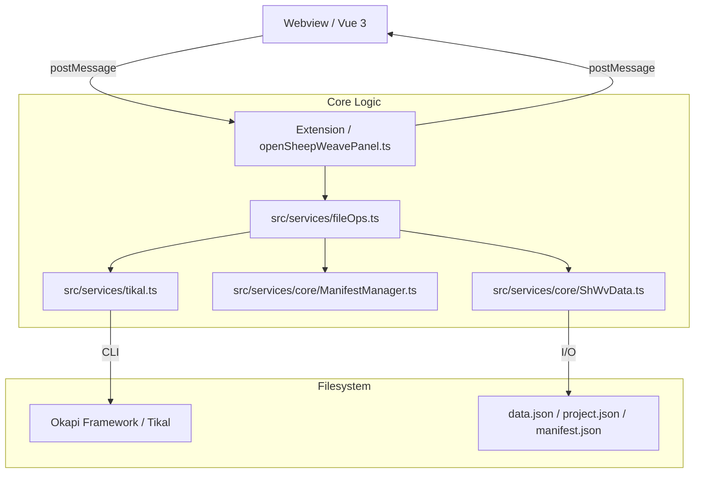

# SheepWeave イベント＆モジュール構造メモ (memo_events.md)

このドキュメントは、SheepWeave におけるフロントエンド（Webview）からバックエンド（Extension）、およびファイル操作の連携フローを整理したものです。

## 1. 全体アーキテクチャ

---

## 2. 主要イベントシーケンス

### A. 初期化・準備 (Initialize & Prepare)
プロジェクトの土台を作る、一連の流れ。

1.  **READY** (Webview起動時)
    - Webview -> Extension: `READY` 送信。
    - Extension: `sheepWeave` の設定を読み込み `CONFIG_LOADED` を返信。
    - Webview: 言語設定などを `config` ref に反映。

2.  **init** (Initialize ボタン)
    - Webview -> Extension: `init` 命令。
    - Extension: `initDirs` を実行。`Archive` の作成と既存 `Working` の退避。

3.  **prepare** (Prepare ボタン)
    - Webview -> Extension: `prepare` 命令 + `payload` (projectName, langs)。
    - Extension:
        1. `prepareWorking`: フォルダ構造 (`01_REF`, `02_SOURCE`等) の作成と `Data` からのコピー。
        2. `project.json`: ルートにプロジェクト設定を保存。
        3. `runTikalExtraction`:
            - `tikal.ts`: 原文ファイルを拡張子ごとにグループ化。
            - `Tikal CLI`: `-x` オプションで XLIFF 抽出。
            - `manifest.json`: 抽出結果とステータスを `Working/` に保存。
            - 生成された `.xlf` を `03_XLF_JSON` へ移動。

### B. 翻訳開始 (Translate Start)
エディタ上に翻訳可能なデータをロードする流れ。

4.  **create** (Create ボタン)
    - Webview -> Extension: `create` 命令。
    - Extension (`preprocessor`):
        1. `setXlf`: `03_XLF_JSON` から最初の XLF を取得。
        2. `parse`: XLF を解析し `globalShWvData` に格納。
        3. `analyze`: TM/TB との照合、類似度算出。
        4. `.shwvs`/`.shwvt`: エディタで編集可能な中間ファイルを作成。
        5. `SHWV_DATA_LOADED`: 統合データを Webview に送信。

### C. 編集・同期 (Editing)
VS Code エディタと Webview のリアルタイムな連携。

5.  **CURSOR_MOVED** (エディタ操作時)
    - Extension (`extension.ts`): `onDidChangeTextEditorSelection` を検知。
    - Extension -> Webview: 現在の行インデックスと内容を送信。
    - Webview: `TranslateTab` のアクティブ行をフォーカス。

6.  **保存時同期**
    - Extension (`extension.ts`): `onDidSaveTextDocument` を検知。
    - Extension: `.shwvt` 保存時に、Extension から Webview へ最新状態をリロード。

### D. 完了 (Post-processing)
翻訳結果を元のバイナリ形式に書き出す流れ。

7.  **complete** (Complete ボタン)
    - Webview -> Extension: `complete` 命令。
    - Extension (`postprocessor`):
        1. `.shwvt` の変更内容を `globalShWvData` に同期。
        2. `saveXlf`: 翻訳済みの最新 XLIFF を `05_COMPLETED` に保存。
        3. `runTikalMerge`:
            - `manifest.json` から原文と XLF の対応を特定。
            - `Tikal CLI`: `-m` オプションでマージ（原文の埋め戻し）。
            - 成果物を `05_COMPLETED` へ集約。

---

## 3. ファイルの役割分担

| ファイル | 保存場所 | 役割 |
| :--- | :--- | :--- |
| **project.json** | ルート | プロジェクト名、ソース/ターゲット言語、対象ファイルリストを管理。 |
| **manifest.json** | Working/ | Tikal 抽出ファイルのステータス、フィルタ設定、元のパスを管理。 |
| **data.json** | Working/03_... | SheepWeave の内部データ（セグメント、TM、TB、メタデータ）のキャッシュ。 |
| **.shwvt / .shwvs** | Working/04_... | ユーザーがエディタで直接編集するテキスト。 |

## 4. 今後の拡張（複数ファイル対応）への展望

- **`preprocessor` / `setXlf`**: 現在の「最初の1つ」から、`manifest.json` にある全 XLIFF をマージして1つのエディタで扱うか、切り替えて扱うかのロジックへ変更が必要。
- **UI (FlowTab)**: 各ファイルのステータス（抽出済み、翻訳率、マージ可否）をリスト表示する機能。
